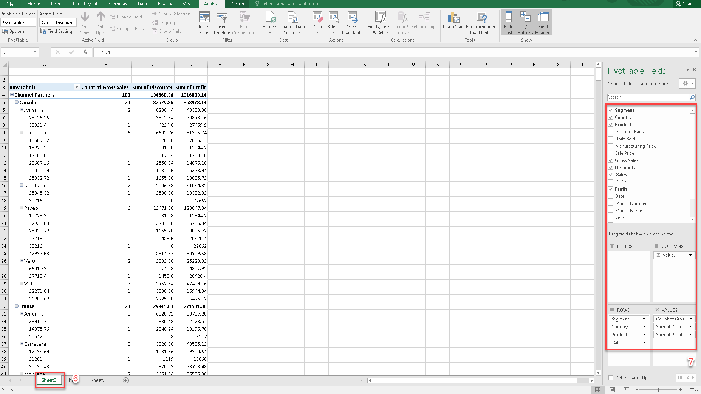

## Pivot Table
PivotTable is a functionality in Excel which helps you organize and analyze data.

It lets you add and remove values, perform calculations, and to filter and sort data sets.

PivotTable helps you structure and organize data to understand large data sets.

### How a PivotTable Works
1. Select range of table you want to perform PivotTable.
2. Go to **Insert** in the top menu.
3. Click **Pivot table**.

4. Select **New Worksheet**.
5. Click **OK**.

6. Go to new appeared sheet.
7. At **PivotTable Fields**, choose fields to add to report.

8. At **drag fields**, select field and click to **Field setting**.
9. Choose the **summarize value** to match the requirement.
